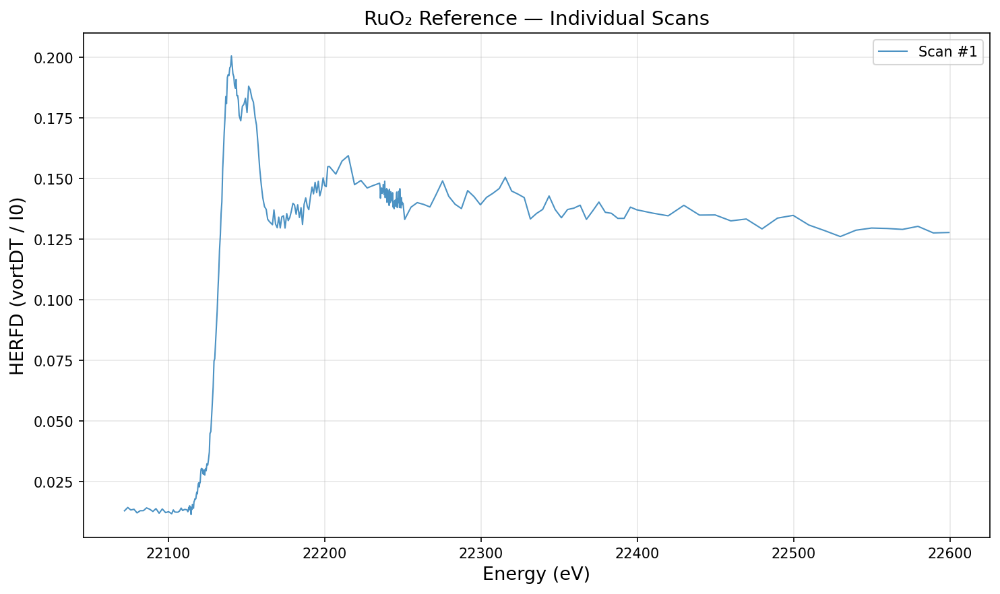
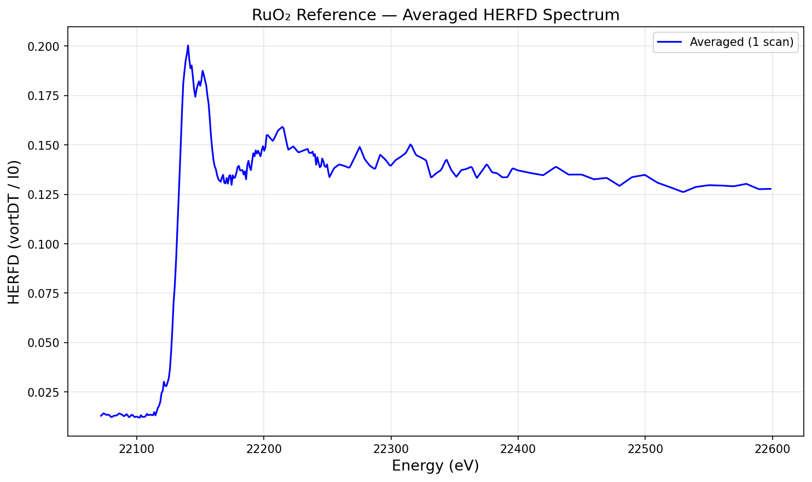
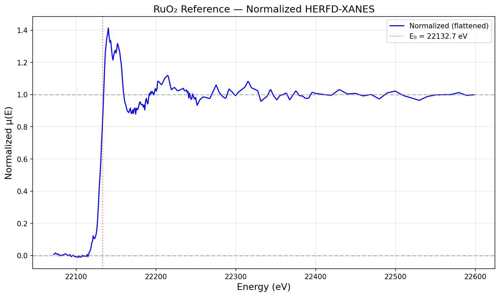

# 🔬 HERFD Agent — SSRL BL 15-2

An AI-powered chat agent for analyzing **HERFD-XAS** (High Energy Resolution Fluorescence Detected X-ray Absorption Spectroscopy) data collected at **SSRL beamline 15-2**.

Talk to your data in natural language — plot spectra, compare samples, normalize XANES, identify elements, and more.

## Features

- **Scan Classification** — Automatically identifies XAS scans vs. alignment, emission, and aborted scans
- **Smart Averaging** — Averages multiple XAS scans with heterogeneous energy grids
- **XANES Normalization** — Athena-style pre-edge subtraction and post-edge normalization with flattening
- **Element Identification** — Guesses the element/edge from metadata and energy range
- **Interactive Chat** — Natural language interface powered by LLM (supports CBORG, OpenAI, Gemini, Claude)
- **File Explorer** — Left sidebar with data directory tree; double-click to paste filenames
- **Command History** — Up/down arrow keys to recall previous commands
- **Plotting** — Inline plots with zoom (x and y axis), auto-scaling, offset stacking, and custom styling
- **Batch Processing** — Process all samples at once (average + normalize + export)
- **Macro Generation** — Create SPEC scan macros for any element/edge with optimized energy grids
- **Batch Run Scripts** — Generate run files for automated multi-sample data collection
- **EXAFS Processing** — Background removal, chi(k) extraction, and Fourier transform to |chi(R)|
- **EXAFS FFT Comparison** — Compare radial distribution functions across samples

## Example: RuO₂ Reference (Ru K-edge)

### Raw Individual Scans


### Averaged Spectrum


### Normalized HERFD-XANES


## Supported Data

- **Format**: SPEC-format `.dat` files (standard at SSRL)
- **Energy Range**: 4.5–37 keV (K-edges for 3d/4d metals, L-edges for 5d metals, lanthanides, actinides)
- **Signal**: `vortDT / I0` (deadtime-corrected vortex detector / ion chamber)
- **Organization**: Sample directories containing multiple scan files

## Quick Start

### 1. Install dependencies

```bash
pip install -r requirements.txt
```

### 2. Configure your LLM API key

Copy `.env.example` to `.env` and set your API key:

```bash
cp .env.example .env
# Edit .env and set one of:
#   CBORG_API_KEY=your-key    (for LBL users)
#   OPENAI_API_KEY=your-key   (for OpenAI)
#   GEMINI_API_KEY=your-key   (for Google Gemini)
#   ANTHROPIC_API_KEY=your-key (for Anthropic Claude)
```

### 3. Add your data

Place your HERFD data in a subdirectory (e.g., `2026-05_Yano/`). The expected structure is:

```
2026-05_Yano/
├── 20260519_RuO2-TiO2_100_normal_dir/
│   ├── 20260519_RuO2-TiO2_100_normal_001.dat
│   ├── 20260519_RuO2-TiO2_100_normal_002.dat
│   └── ...
├── 20260521_RuO2_Ref_dir/
│   └── ...
└── readme.txt
```

Set the data directory in `.env` if different from the default:
```
HERFD_DATA_DIR=2026-05_Yano
```

### 4. Launch the agent

```bash
python run_agent.py
```

This starts the server and opens your browser at `http://localhost:5051`.

## Usage

### Chat Interface

Type natural language commands in the chat:

- **"List samples"** — Show all sample directories
- **"Plot 110_normal"** — Average and plot a sample's HERFD spectrum
- **"Compare 100_normal and 110_normal"** — Overlay spectra
- **"Normalize RuO2_Ref"** — XANES normalization with flattening
- **"What element is this?"** — Identify element from energy range
- **"Show all scans for 100_grazing"** — Check individual scan quality
- **"Process all samples"** — Batch average + normalize + export
- **"Zoom in from 22110 to 22150 eV"** — Energy range zoom
- **"Set y axis from 0 to 1.5"** — Y-axis range control
- **"Plot EXAFS for RuO2_Ref"** — EXAFS chi(k) in k-space
- **"Show FFT of 110_normal"** — Fourier transform |chi(R)|

### Command-Line Interface

```bash
# Scan summaries
python herfd_utils.py --summary

# Batch process all samples
python herfd_utils.py --process-all

# Process a specific sample
python herfd_utils.py --process 2026-05_Yano/20260519_RuO2-TiO2_110_normal_dir

# Average specific scans
python herfd_utils.py --average 2026-05_Yano/20260519_RuO2-TiO2_110_normal_dir --scans 6 7 8 9 10
```

### Python API

```python
import herfd_utils as hu

# Average a sample
energy, mu, files = hu.average_sample_dir("2026-05_Yano/20260519_RuO2-TiO2_110_normal_dir")

# Normalize
norm = hu.normalize_xanes(energy, mu)
print(f"E0 = {norm['e0']:.1f} eV")

# Use flattened spectrum for display
mu_flat = norm["flat"]  # post-edge ≈ 1.0

# Derivatives
deriv1 = hu.smooth_derivative(energy, mu, order=1)

# Identify element
candidates = hu.identify_element_from_energy((energy.min(), energy.max()), "RuO2-TiO2")
```

## File Structure

```
├── chat_app.py          # Flask chat web app (15 LLM tools)
├── herfd_utils.py       # Core data processing utilities
├── run_agent.py         # One-click launcher
├── requirements.txt     # Python dependencies
├── .env.example         # LLM API key template
├── .gitignore           # Git exclusions
├── README.md            # This file
├── docs/                # Documentation figures
│   ├── raw_scans.png
│   ├── averaged.png
│   └── normalized.png
└── example_data/        # Example RuO₂ reference data (Ru K-edge)
    ├── 20260521_RuO2_Ref_dir/
    │   ├── 20260521_RuO2_Ref_001.dat
    │   └── 20260521_RuO2_Ref_002.dat
    └── exported/
        ├── averaged/
        │   └── 20260521_RuO2_Ref_avg.dat
        └── normalized/
            └── 20260521_RuO2_Ref_norm.dat
```

## EXAFS Processing

The agent includes a complete EXAFS processing pipeline:

1. **Background removal** — Simplified Autobk algorithm using cubic spline fitting
2. **chi(k) extraction** — Normalized EXAFS oscillations in k-space
3. **Fourier transform** — FFT with configurable window functions (Hanning, Kaiser, Sine)

### Chat Examples

- **"Plot EXAFS for RuO2_Ref"** — Shows k²·χ(k) 
- **"Show FFT of 110_normal"** — Plots |χ(R)| with peak positions
- **"Compare FFT of 100_normal, 110_normal, 111_normal"** — Overlay radial distributions
- **"Plot EXAFS FFT with kweight=3 and kmax=12"** — Custom parameters

### Python API

```python
import herfd_utils as hu

# Load and average
energy, mu, files = hu.average_sample_dir("2026-05_Yano/20260521_RuO2_Ref_dir")

# Full EXAFS pipeline
result = hu.process_exafs(energy, mu, kmin=2.0, kmax=10, kweight=2)

# Access results
k = result["k"]           # k in Angstrom^-1
chi = result["chi"]       # chi(k)
r = result["r"]           # R in Angstrom
chir_mag = result["chir_mag"]  # |chi(R)|

# Or step by step:
bkg = hu.autobk_background(energy, mu, e0=22132.7, rbkg=1.0)
ft = hu.xftf(bkg["k"], bkg["chi"], kmin=2, kmax=10, kweight=2, window="hanning")
```

### Parameters

| Parameter | Default | Description |
|-----------|---------|-------------|
| `kmin` | 2.0 | Minimum k for FT window (Å⁻¹) |
| `kmax` | auto | Maximum k (from data range) |
| `kweight` | 2 | k-weighting power (0, 1, 2, or 3) |
| `dk` | 1.0 | Window edge width (Å⁻¹) |
| `window` | hanning | Window function (hanning, kaiser, sine) |
| `rbkg` | 1.0 | Background R cutoff (Å) |
| `rmax` | 6.0 | Maximum R to display (Å) |

> **Note:** R values from the FFT are phase-uncorrected. Real bond distances are typically 0.3–0.5 Å longer than the FFT peak positions.

## Macro Generation

The agent can generate SPEC macros for data collection at BL 15-2. It automatically creates optimized energy grids for any element and edge.

### Chat Examples

- **"Generate a macro for Fe K-edge"** — Creates a complete SPEC macro with energy grid around 7112 eV
- **"Create a Pt L3-edge macro with 0.2 eV steps and EXAFS"** — Fine XANES + EXAFS scan
- **"Make a run file for 3 samples at Sz=2, 19.5, 33.5"** — Batch run script

### Python API

```python
import herfd_utils as hu

# Generate energy grid for Fe K-edge
grid = hu.generate_energy_grid("Fe", "K")
# "7062 7092 2 7105 1 7122.0 0.3 7142.0 0.5 7192.0 1 7312.0 4 7612.0 10"

# Generate complete SPEC macro
macro = hu.generate_xas_macro("Fe", "K", count_time=1, xanes_step=0.3)
```

### Example: Generated Fe K-edge Macro

The energy grid is automatically optimized with multiple regions:

| Region | Energy Range (eV) | Step (eV) | Purpose |
|--------|-------------------|-----------|---------|
| 7062 → 7092 | 2.0 | Pre-edge (coarse) |
| 7092 → 7105 | 1.0 | Approaching edge |
| 7105 → 7122 | 0.3 | **Edge region** (fine) |
| 7122 → 7142 | 0.5 | Near-edge / white line |
| 7142 → 7192 | 1.0 | Post-edge XANES |
| 7192 → 7312 | 4.0 | Extended post-edge |
| 7312 → 7612 | 10.0 | Far post-edge |

<details>
<summary>Click to see the full generated macro</summary>

```
# Fe_xas cntSec  nbrScan  emission  nbrFilter
# Element: Fe, Edge: K, E0 = 7112.0 eV
def Fe_xas '{
    local scan_ctime scan_repeat
    local ndx nbrFilter
    global XAS_MAIN_GRID
    local  arr_tmp xas_start

    XAS_MAIN_GRID  = "7062 7092 2 7105 1 7122.0 0.3 7142.0 0.5 7192.0 1 7312.0 4 7612.0 10"

    split(XAS_MAIN_GRID, arr_tmp)
    xas_start = arr_tmp["0"]

    if ($# < 4) {
        printf("\n\nSyntax:\n")
        printf("    Fe_xas  cntSec  nbrScan  emission  nbrFilter\n\n")
        return
    }
    ...
    for (ndx=0; ndx< scan_repeat; ndx++) {
        eval(sprintf("umv energy %f",xas_start))
        eval(sprintf("mv filter %d",nbrFilter))
        sleep(0.25)
        eval(sprintf("gscan energy %s %f", XAS_MAIN_GRID, scan_ctime))
    }
}'
```

</details>

### Supported Elements (4.5–37 keV)

| Category | Elements | Edge |
|----------|----------|------|
| 3d metals | Ti, V, Cr, Mn, Fe, Co, Ni, Cu, Zn | K |
| 4d metals | Zr, Nb, Mo, Tc, Ru, Rh, Pd, Ag, Cd | K |
| 5d metals | Hf, Ta, W, Re, Os, Ir, Pt, Au | L₃, L₂ |
| Lanthanides | La, Ce, Pr, Nd, Sm, Eu, Gd, Tb, Dy, Ho, Er, Yb | L₃, L₂ |
| Actinides | Th, U, Np, Pu | L₃ |
| Others | Ga, Ge, As, Se, Br, Sr, Y | K |


## Try with Example Data

The repo includes RuO₂ powder reference data (Ru K-edge) so you can test immediately:

```bash
# Set data dir to example_data
export HERFD_DATA_DIR=example_data

# Run the CLI
python herfd_utils.py --summary
python herfd_utils.py --process-all

# Or start the agent
python run_agent.py
```

## Normalization Details

The XANES normalization follows the **Athena-style** approach:

1. **E0 detection** — Maximum of smoothed 1st derivative
2. **Pre-edge fit** — Linear fit to E0−50 to E0−15 eV
3. **Post-edge fit** — Quadratic fit to E0+30 to end of data
4. **Edge step** — post_edge(E0) − pre_edge(E0)
5. **Normalized μ** — (μ − pre_edge) / edge_step
6. **Flattening** — Removes post-edge slope so it oscillates around 1.0

The **flattened** spectrum (`mu_flat`) is used by default, which is important for hard X-ray data with wide energy ranges where the raw normalized spectrum shows natural post-edge decay.

